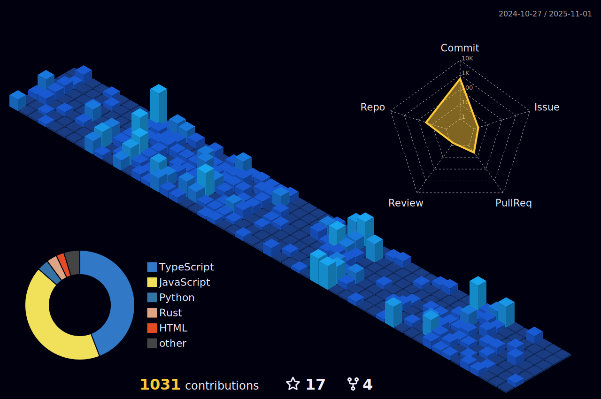

- 👨🏻‍💻 Want to know about me [My Portfolio](https://bkarthik7.github.io/Portfolio/)

- 📫 How to reach me **bangikarthik7@gmail.com**

- 📄 Know about my experiences [My Resume](https://drive.google.com/file/d/1o-Z2SKiybNiB_t5peP-yVohAKIwOS0UI/view?usp=sharing)

- ⚡ Fun fact **Japan has over 200 flavours of Kit Kats. !!**

<h3 align="left">Connect with me:</h3>

<h3 align="left">Languages and Tools:</h3>

  

